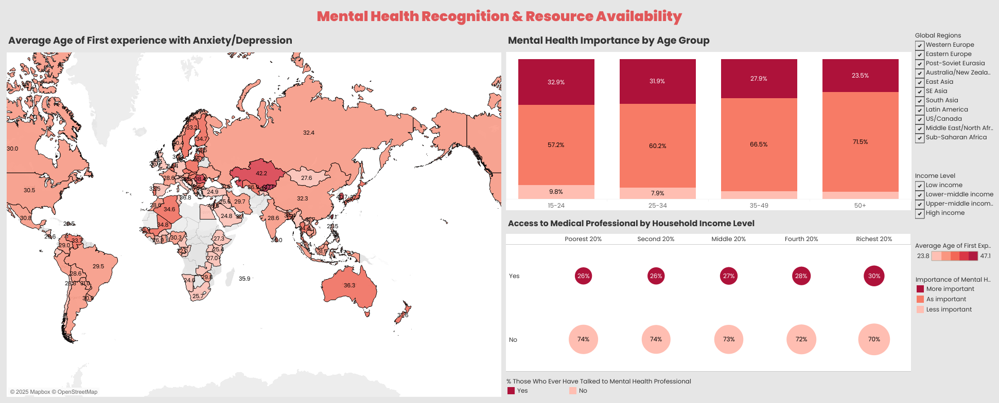

# Projects in data science, machine learning, and data visualization 

## Customer Classification Model 
Analyzed booking behaviors to build a predictive model that classifies travelers as business or leisure. The goal was to support personalized marketing and optimize product offerings. The source of booking and discount code emerged as strong predictors of traveler type than other trip details (e.g., cabin class, group size), enabling real-time communication at the moment of booking. The model achieved 83% accuracy.

*Tools & Techniques* 
- R, dplyr, tidyr, ggplot2
- Logistic regression, Ridge regression
- Confusion matrix, AUC used for model performance evaluation 

##  Exploring Mental Health Recognition & Access 
Developed an interactive dashboard using Tableau to explore disparities in meantal health recognition and resource access across regions, generations, and income levels. While Gen Zs are more open to mental health, the data revealed gaps in early recognition of anxiety/depression – even within the same region, highlighting the need for culturally sensitive outreach and support. 
 
